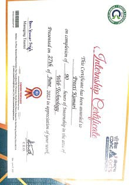
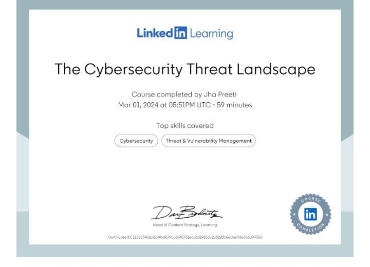
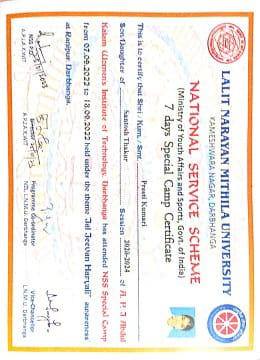
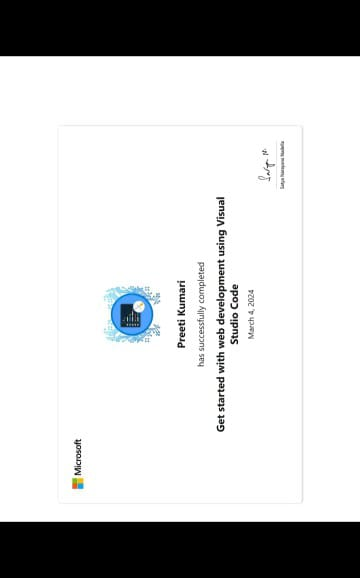

# 🏅 My Certifications

This repository contains my professional certifications earned across various technical domains, reflecting my continuous learning and skill development.

---

## 📂 Certifications Included

Below are the certifications stored in this repository:

| Certification Title | Issued By |
|----------------------|------------|
| CDAC Internship | CDAC |
| Cybersecurity Threat Landscape | Microsoft |
| Cybersecurity Awareness | LinkedIn Learning |
| Frontend Developer | Simplilearn |
| NSS Certificate | National Service Scheme |
| Python Professional | iFuture Technologies |
| Web Accessibility | Microsoft |
| Web Development | Microsoft |

---

## 📸 Certificate Previews

> *(Click on the image to view full size)*

### 🔹 CDAC Internship  

### 🔹 Cybersecurity Threat Landscape  

### 🔹 Cybersecurity Awareness – LinkedIn  

### 🔹 Frontend Developer – Simplilearn  

### 🔹 NSS Certificate  

### 🔹 Python Professional – iFuture Tech  

### 🔹 Web Accessibility – Microsoft  

### 🔹 Web Development – Microsoft  

---

## 🚀 Skills Gained Through These Certifications

- Frontend Development (HTML, CSS, JavaScript)
- Cybersecurity Fundamentals & Awareness
- Python Programming & Problem Solving
- Accessibility & Inclusive Web Design
- Internship Experience & Practical Exposure

---

## 📍 Repository Purpose

✔ Keep all certifications in a central verified location  
✔ Easily share with recruiters & resume links  
✔ Showcase continuous learning & achievements  

---

🌟 *If you find this repository helpful or inspiring, consider giving it a star!*  
